# 简易微信小程序 小说 短片 音乐

<!--  {:height="36px" width="36px"} -->

## 目录结构

- [components](components) 组件
  - book
  - capsule
  - loading
  - capsule
  - video
- [pages](pages)
  - [books](pages/books) 小说页面
  - [movies](pages/movies) 短片页面
  - [musics](pages/musics) 音乐页面
  - [my](pages/my)  我的
- [custom-tab-bar](custom-tab-bar) 自定义tabbar
- [model](model) 请求模块封装
- [static](static) 静态资源

## 预览

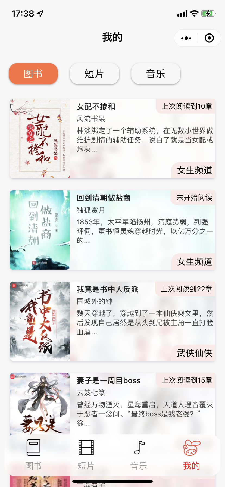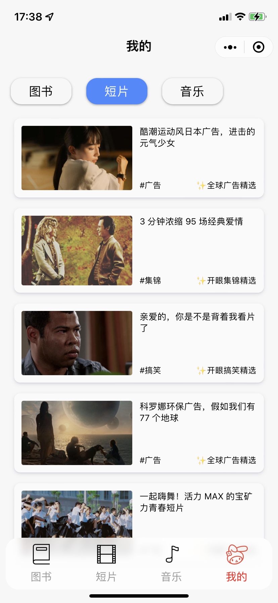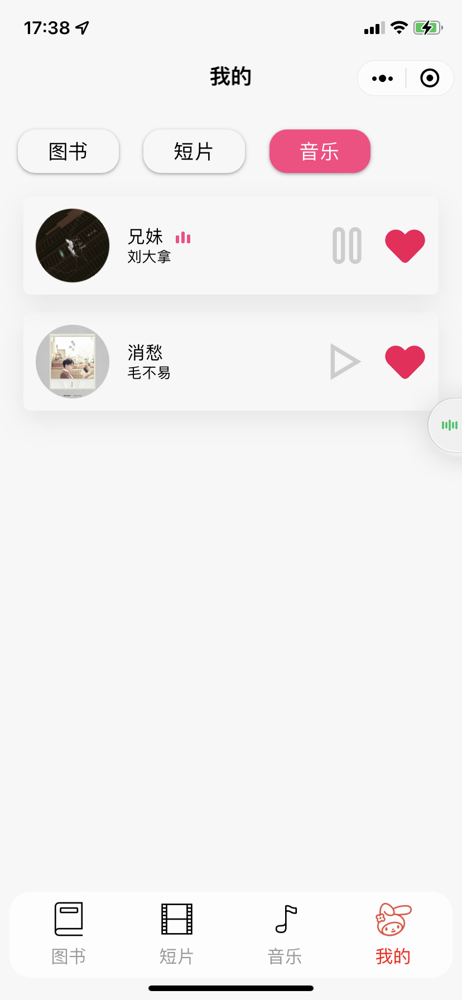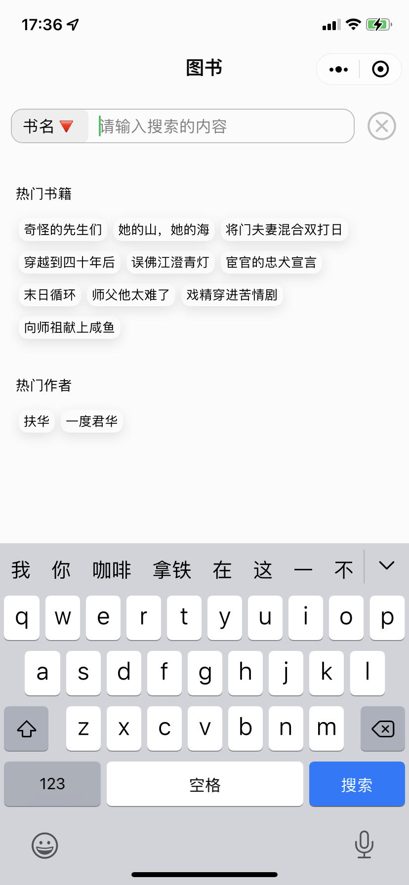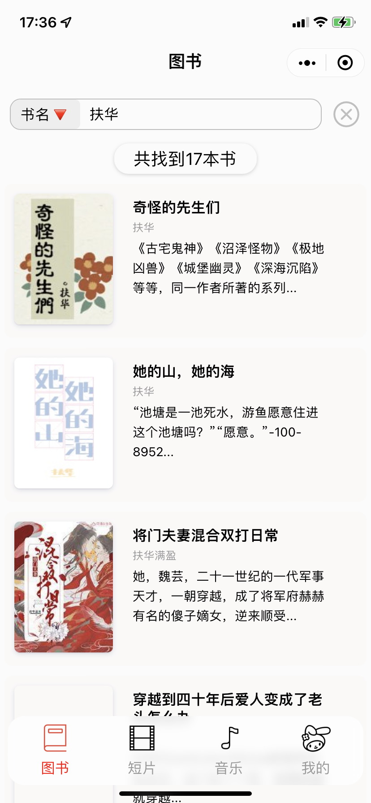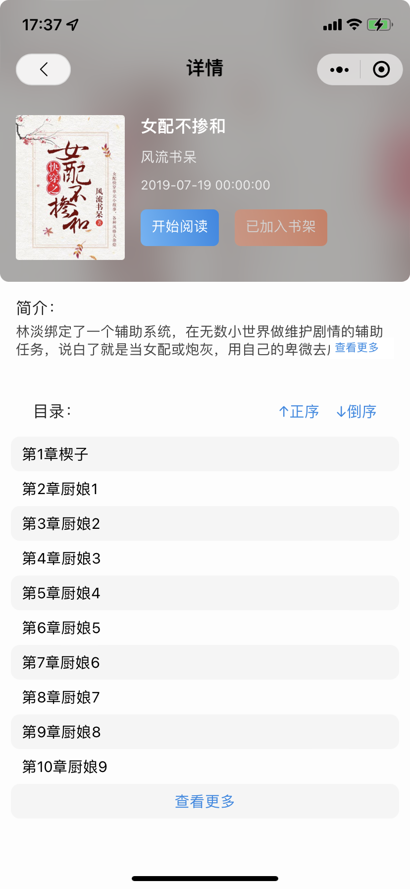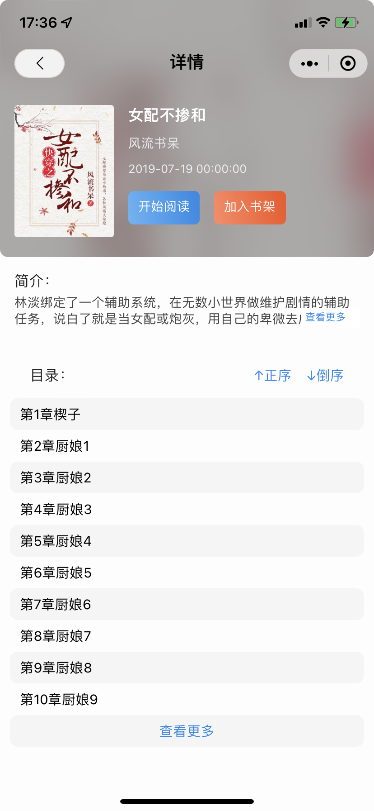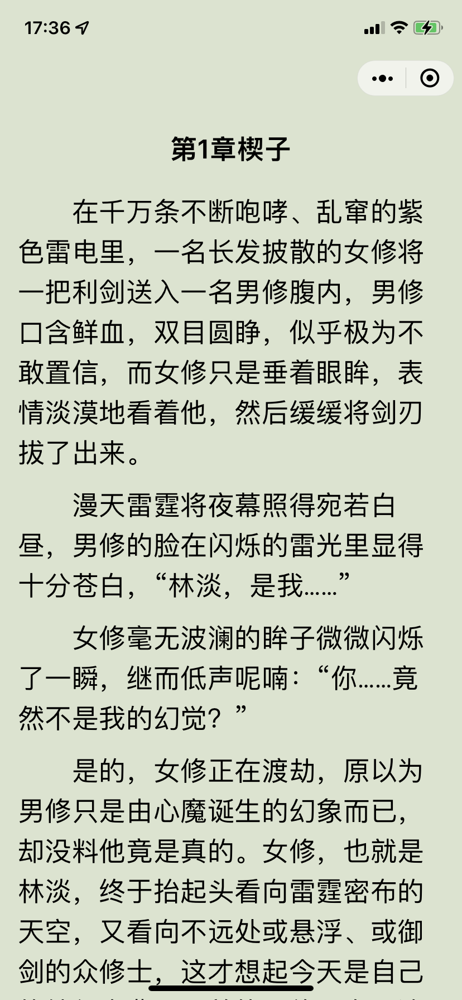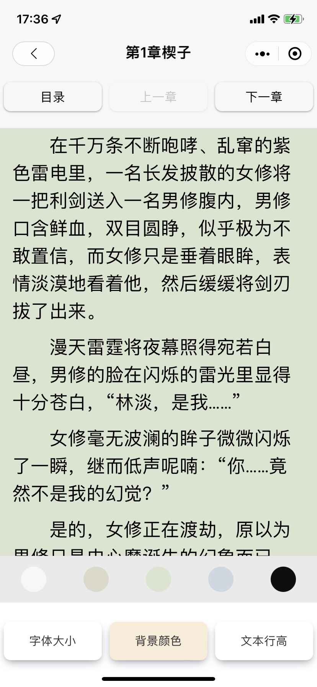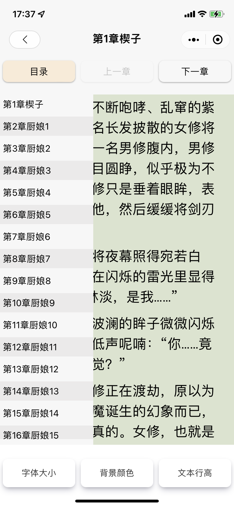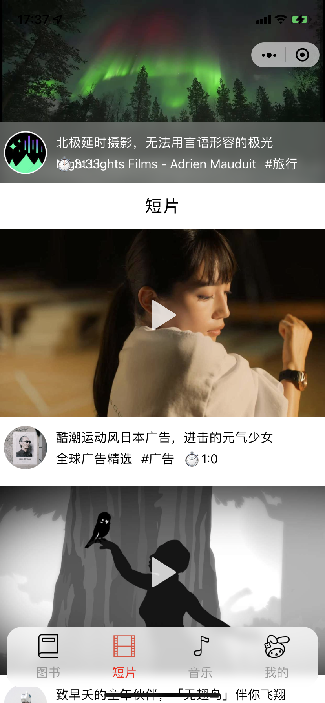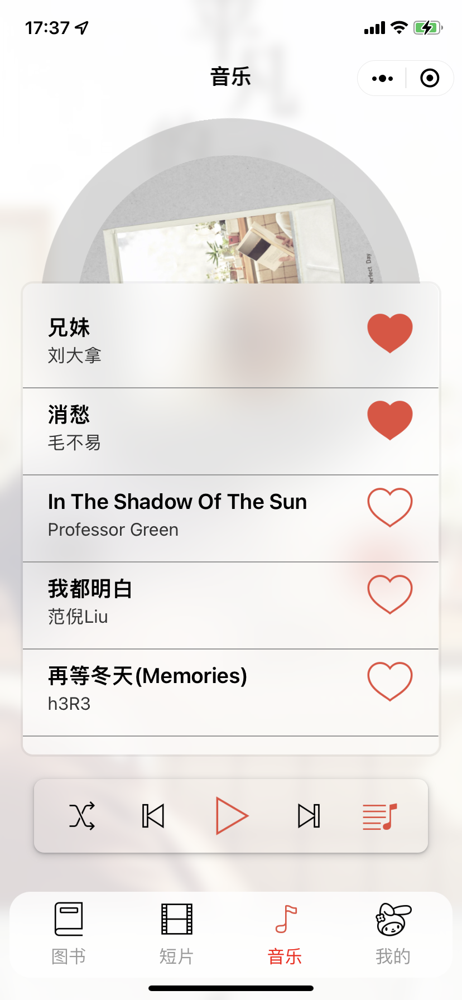
